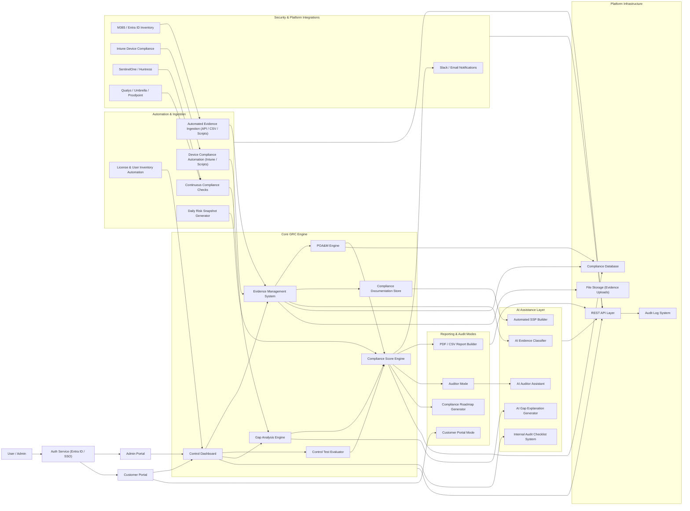

# Calyptor – GRC & Compliance Automation Platform

Calyptor is a modern compliance and security workflow platform designed to simplify CMMC, NIST 800-171, and enterprise evidence management. This repository contains architecture documentation, automation prototypes, schemas, diagrams, and early-stage tooling that define the Calyptor ecosystem.

---

## 📌 Features & Components

### **Core GRC Engine**
- Control Dashboard  
- Evidence Management System  
- Control Test Evaluator  
- Gap Analysis Engine  
- POA&M Engine  
- Compliance Score Engine  

### **Automation Layer**
- Automated evidence ingestion  
- Continuous compliance checks  
- License & user inventory automation  
- Device compliance automation (Intune / API)  
- Daily risk snapshots  

### **Reporting & Audit**
- Auditor mode  
- Customer portal mode  
- CSV/PDF reporting  
- Compliance roadmap generator  

### **AI Assistance Layer**
- AI Evidence Classifier  
- AI Gap Explanation Generator  
- AI Auditor Assistant  
- Automated SSP Builder  
- Internal Audit Checklist System  

---

## 🧱 Architecture Diagram


---

📁 Repository Structure

/docs        → Detailed design documents, workflows, SSA/POA&M logic  
/diagrams    → Mermaid and Figma architecture diagrams  
/src         → Demo scripts, prototypes, schema examples  
---

## 🧪 Control Test Evaluator API Demo  

A minimal API schema and demo implementation for submitting compliance control tests and receiving evaluation status.

- **Schema**: see `/docs/control-evaluator-schema.yaml`  
- **Demo API**: see `/src/python/control_evaluator_demo.py`  
- **Run locally**:
```bash
cd src/python
pip install fastapi[all]
python control_evaluator_demo.py
```

- **Example request**:
```json
POST /evaluate-control
{
  "controlId": "AC.1.001",
  "evidenceIds": ["EVID-001","EVID-002"],
  "testResult": "pass",
  "testedAt": "2025-12-01T09:00:00Z",
  "comments": "All devices compliant"
}
```

- **Example response**:
```json
{
  "controlId": "AC.1.001",
  "status": "compliant",
  "evaluatedAt": "2025-12-01T09:05:00Z",
  "details": {
    "evidenceIds": ["EVID-001","EVID-002"],
    "comments": "All devices compliant"
  }
}
```

🚀 Status

Calyptor is currently in R&D phase, with architecture, workflows, and prototypes being documented for future development.

Stay tuned for further updates — or reach out to collaborate.
